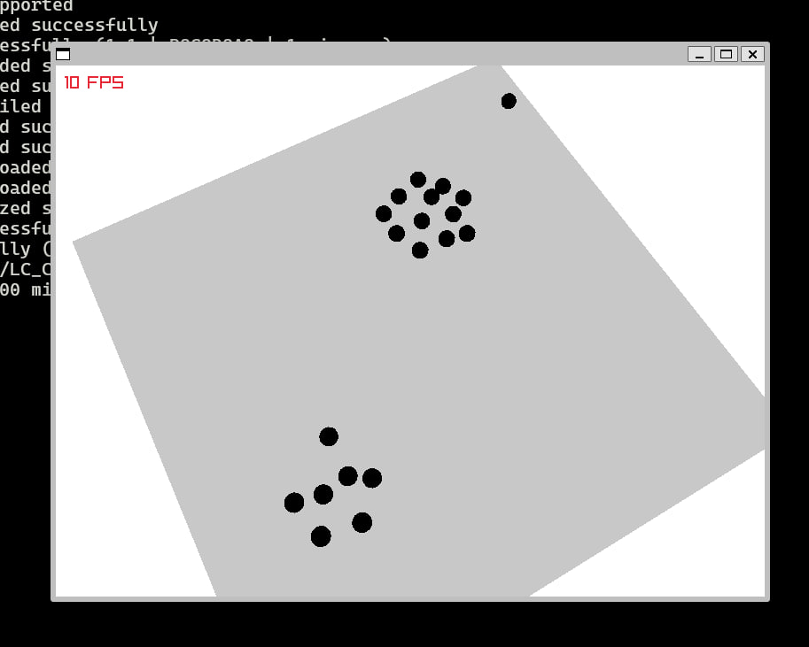

# Argos Visualizer

This piece of software acts as an action-replay for Argos simulations ran with `argos-experiments`.

# Dependencies

- raylib
- jsoncpp
- meson

## OpenSUSE

Install `raylib-devel jsoncpp-devel meson`

## Fedora

Install `raylib-devel jsoncpp-devel meson`

## Arch Linux

Install `raylib jsoncpp`

# Building

`make`

# Running

Make sure that you have a `out` directory from `argos-experiments` in the current directory and use `make run` or call the executable directly as `./builddir/main.exe`.

